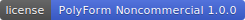

# Sudoku Pilot

[](LICENSE)

[Open Sudoku Pilot](https://sudokupilot.com)

Sudoku Pilot helps you learn the techniques behind a solve and spot them on the board yourself.

When you get stuck, the coach shows the logical moves available from the techniques you selected. You decide how much of the explanation to reveal, which techniques to practice, and which routine deductions to automate.

## What makes it different

- **See the reasoning, not just an answer.** Browse every logical move supported by your selected techniques, inspect the affected cells, and choose the move you want to make. Hints never silently change the board.
- **Reveal only the help you need.** Hints progress from the technique, to where to look, to the pattern's location, and finally to the exact move. “Why does this work?” is there when you want the deeper explanation.
- **Practice one technique at a time.** Each committed technique has a lesson plus three practice modes: find the pattern, complete the puzzle, and tell a real pattern from a near miss.
- **Skip deductions you have already mastered.** Automate selected techniques until the puzzle reaches a move worth your attention, or run one named technique at a time.

## Top features

- **Progressive coaching catalog.** Learn and practice 17 fully coached techniques: Last Digit; Naked and Hidden Singles; Pointing and Claiming Candidates; Hidden Pairs and Triples; Naked Pairs, Triples, and Quads; X-Wing; Swordfish; Skyscraper; 2-String Kite; XY-Wing; XYZ-Wing; and W-Wing. Hidden Quadruple, Jellyfish, Crane, Simple Colouring, and Empty Rectangle are also available as clearly labeled provisional detectors.
- **No guessing required.** Every generated puzzle has a unique solution and a verified logical path from start to finish. You will never need trial and error, sometimes called Bowman's Bingo, to complete one.
- **Every available next move.** Instead of choosing one hint for you, the coach lets you compare all the logical moves currently available from your selected techniques.
- **Hints that do not spoil the solve.** Reveal help gradually, from the technique and where to look through the exact move. Stop as soon as you have enough to continue on your own.
- **Practice for a specific technique.** Choose the pattern you want to learn instead of waiting for it to appear in a random puzzle. Practice finding it, using it in a complete solve, and distinguishing it from near misses.
- **Technique-based difficulty.** Puzzle ratings reflect the logical techniques and effort in Sudoku Pilot's verified solve path, not simply the number of given digits.
- **Automation for familiar techniques.** Let Sudoku Pilot handle deductions you already know until the puzzle reaches a move worth your attention, or run one named technique at a time.
- **Import a puzzle for review.** Start from a screenshot, correct the recognized filled digits and pencil notes in an editable grid, and then solve or ask the coach to review the board.
- **Input that works the way you solve.** Choose cell-first or digit-first entry, use the on-screen number pad or keyboard, and add a note to several cells at once. Fill or clear all pencil notes, undo moves, and configure peer highlights, matching-digit highlights, the timer, and live mistake feedback.
- **Local-first and offline-friendly.** Your puzzle progress stays in your browser, and the installable app works offline after loading. Screenshot OCR is an optional online action that sends the selected puzzle image to Sudoku OCR through RapidAPI.

Technique detection never repairs an imported puzzle or overwrites a player's decisions. The solver tracks logical candidates separately from player-entered notes, so partial notes cannot create false deductions.

## Local, installable, and offline-friendly

Sudoku Pilot is a local-first Vite app with one serverless endpoint for optional screenshot OCR. It can be installed as a PWA, its app shell works offline after loading, and the current puzzle, notes, undo history, and technique selections are stored locally in the browser.

Generated puzzles, manual entry, solving, notes, hints, and practice stay available without the OCR endpoint. Screenshot recognition requires a connection and available provider quota.

## Optional online screenshot OCR

Starting screenshot recognition sends the selected image to Sudoku Pilot's `/api/sudoku-ocr` serverless function. The function forwards that image to Sudoku OCR through RapidAPI and returns the recognized grid for review. Each scan consumes a metered service paid for by Sudoku Pilot; users are not charged, and no payment information is requested. The RapidAPI credential stays on the server, and availability depends on the quota and status of the site's subscription.

The OCR provider's image handling and retention policy is not publicly detailed. Avoid uploading screenshots that contain personal or sensitive information. Ordinary gameplay remains local-first and does not require an image upload.

For local endpoint development, copy the example environment file and add a RapidAPI key:

```sh
cp .env.example .env.local
# Edit .env.local and set RAPIDAPI_KEY to the server-side RapidAPI credential.
# Set SUDOKU_OCR_ENABLED=true only when this environment may spend OCR quota.
npx vercel dev
```

`npm run dev` still runs the Vite app for ordinary gameplay work. Use `vercel dev` when the browser must call the local serverless OCR endpoint. Never prefix the provider key with `VITE_`, which would expose it to browser code.

For a Vercel deployment, add `RAPIDAPI_KEY` as a Sensitive environment variable. Keep `SUDOKU_OCR_ENABLED=false` until the RapidAPI subscription dashboard confirms that a hard request cap is active; only then set it to `true` for environments that should support OCR and redeploy. Keep the key out of source control and client-visible configuration. Preview environments should stay disabled unless they intentionally share the quota.

`SUDOKU_OCR_MAX_CALLS_PER_IP_PER_HOUR` is a best-effort per-instance abuse brake; it is not a durable billing limit in a serverless deployment. A confirmed provider-side hard request cap is the required billing control. A response header that reports a request limit is useful monitoring data, but is not by itself proof that overages are disabled. Do not enable production OCR or move to a plan with paid overages until the subscription has a verified hard cap, or the endpoint has durable cross-instance rate limiting or authenticated entitlements. `SUDOKU_OCR_ENABLED=false` is a fail-closed, deployment-time switch; for an emergency cutoff before a redeploy completes, disable the RapidAPI subscription or credential.

The normal test suite uses a mocked provider and does not spend OCR quota. A separate live check makes exactly one provider request and must be confirmed explicitly:

```sh
npm run test:sudoku-ocr-live -- --confirm-live-call
```

The live check loads `RAPIDAPI_KEY` from `.env.local` and prints the quota headers returned by RapidAPI. Each provider call also emits a structured `sudoku_ocr_provider_call` entry with `provider_calls: 1`, `retry: false`, image size and type, request ID, and UTC billing month. The matching `sudoku_ocr_provider_response` entry records status, duration, and available quota headers. Use Vercel function logs to count calls and investigate failures, and use the RapidAPI dashboard to confirm plan usage and remaining quota.

## Product analytics

Vercel Web Analytics measures aggregate page traffic. PostHog records gameplay funnels, feature adoption, browser-level retention, automatic interaction analytics, and session replays. Analytics is optional: without a project key, the PostHog module is not loaded and the app remains fully functional.

Copy `.env.example` to `.env.local` for local development, or set the same variables in Vercel:

```sh
VITE_POSTHOG_KEY=<public PostHog project key>
VITE_POSTHOG_HOST=https://us.i.posthog.com
```

Use `https://eu.i.posthog.com` for an EU project. The public project key is safe to expose to the browser, but it must still be configured through environment settings rather than committed to source.

PostHog captures `app_opened`, puzzle start/first-move/meaningful-play/completion milestones, hint requests, lesson and practice activity, and screenshot-import workflow outcomes. Meaningful play is five entered or applied moves. Custom events contain aggregate context such as difficulty, source, elapsed seconds, move count, and hint count; they do not attach screenshots, OCR grids, individual cell values, pencil notes, candidates, or individual move contents.

The full PostHog browser suite is enabled: session replay, autocapture, page views and page leave, heatmaps, dead-click detection, performance metrics, exception and console capture, surveys, feature flags, and remote project configuration. Replay includes puzzle interactions but blocks the screenshot-import panel so the imported image itself is not recorded. PostHog manages analytics delivery and can buffer or retry events after a connection failure. PostHog is loaded asynchronously and is never required for startup, solving, OCR, or offline use.

## Run locally

```sh
npm install
npm run dev
```

Run `npm run build` to create a production build in `dist/`. Build and review output is generated locally and is not committed.

Verification commands:

```sh
# Standard suite
npm run build
npm test

# Focused checks
npm run test:solver
npm run test:coaching
npm run test:learning-practice
npm run test:functional
npm run review:coaching
npm run measure:learning-practice
npm run review:learning-practice
```

## Production puzzle catalog

The production catalog contains 100 canonically distinct, certified puzzles at each of Easy, Medium, Hard, Expert, and Extreme. Runtime selection starts with an unplayed canonical seed when possible, then applies a visual Sudoku transformation. Transformed copies retain the seed's canonical ID and do not count as new logical puzzles.

Catalog generation is an offline, resumable build. Its SQLite working state and full solution traces live under `.catalog-build/` and are not shipped. A provider-neutral Postgres warehouse durably retains puzzle identities, generation events, versioned evaluations, and catalog snapshots. Compact runtime shards live in `src/catalog/`; checked shipped and before/after quality audits live under `output/`. Expert and Extreme production entries must each demonstrate at least five deterministic tier-level unblocking gates while remaining within their technique ceiling.

```sh
# Resume until the 100-per-level catalog is compiled
npm run catalog:build

# Rebuild from a fresh SQLite state
npm run catalog:rebuild

# Optional and expensive: independently re-rate and canonicalize all 500
# shipped entries. Run after generation changes files in src/catalog/.
npm run catalog:verify

# Refresh the checked audit from the shipped catalog
npm run catalog:audit

# Refresh the before/after hard-gate and generation-inventory audit
npm run catalog:quality:audit

# Archive all local candidates in Postgres (accepted and rejected)
PUZZLE_WAREHOUSE_URL=postgres://... npm run catalog:warehouse:sync

# Inspect durable warehouse counts
PUZZLE_WAREHOUSE_URL=postgres://... npm run catalog:warehouse:inspect
```

The production warehouse is a private Neon database provisioned through Vercel Marketplace as `sudoku-puzzle-warehouse`. It is connected to this Vercel project in Development, Preview, and Production with the `PUZZLE_WAREHOUSE_` prefix. The scripts automatically use Neon's generated `PUZZLE_WAREHOUSE_DATABASE_URL_UNPOOLED`; `PUZZLE_WAREHOUSE_URL` remains available as a provider-neutral explicit override.

When either warehouse URL is configured, catalog builds sync automatically after compilation and before a destructive rebuild. Without one, `catalog:rebuild` refuses to erase an existing local archive unless `--allow-unarchived-reset` is explicitly supplied.

The pipeline, warehouse schema, quality gates, provenance policy, and recovery workflow are documented in [resources/catalog-pipeline.md](resources/catalog-pipeline.md).

## Publish an article

Each article lives in `content/articles/<slug>.json`. The file contains its copy, dates, image, caption, related links, sections, and content blocks.

`scripts/build-content.mjs` supplies the shared page layout, metadata, structured data, navigation, image dimensions, related articles, sitemap, and validation. `public/content.css` supplies the shared presentation.

Use the Codex skill in `skills/publish-sudoku-article` to create, verify, and publish an article. It is installed locally at `~/.codex/skills/publish-sudoku-article`. Run `npm run build` and `npm run test:content` after every content change.

The product rationale and original requirements are documented in [resources/PRD.md](resources/PRD.md). The current online, note-aware OCR decision is specified in [resources/trusted-import-v0.2.md](resources/trusted-import-v0.2.md); [v0.1](resources/trusted-import-v0.1.md) is preserved as the earlier browser-local research decision. The first-party corpus contract remains in [resources/trusted-import-evaluation/README.md](resources/trusted-import-evaluation/README.md). Reference material lives in `resources/`. Generated reviews and measurements are written to the ignored `output/` directory; the certified catalog audit is the only tracked output artifact.

## License

Sudoku Pilot's source is available under the [PolyForm Noncommercial License 1.0.0](LICENSE). You may use, modify, and redistribute it for permitted noncommercial purposes. Commercial use is not licensed; contact `hello@sudokupilot.com` to discuss separate commercial terms. Because this license restricts commercial use, this project is source-available rather than open source under the Open Source Definition. See [THIRD_PARTY_NOTICES.md](THIRD_PARTY_NOTICES.md) for redistributed software, font, and dataset attribution.

The Sudoku Pilot name, logo, visual identity, and other branding are reserved. The software license does not grant permission to use them for a fork, derivative product, or service, or to imply endorsement or affiliation. See the [brand policy](TRADEMARKS.md).
